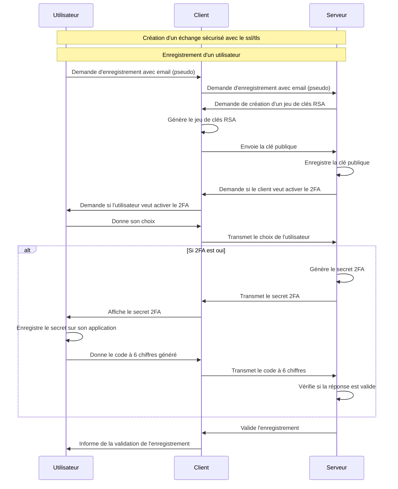
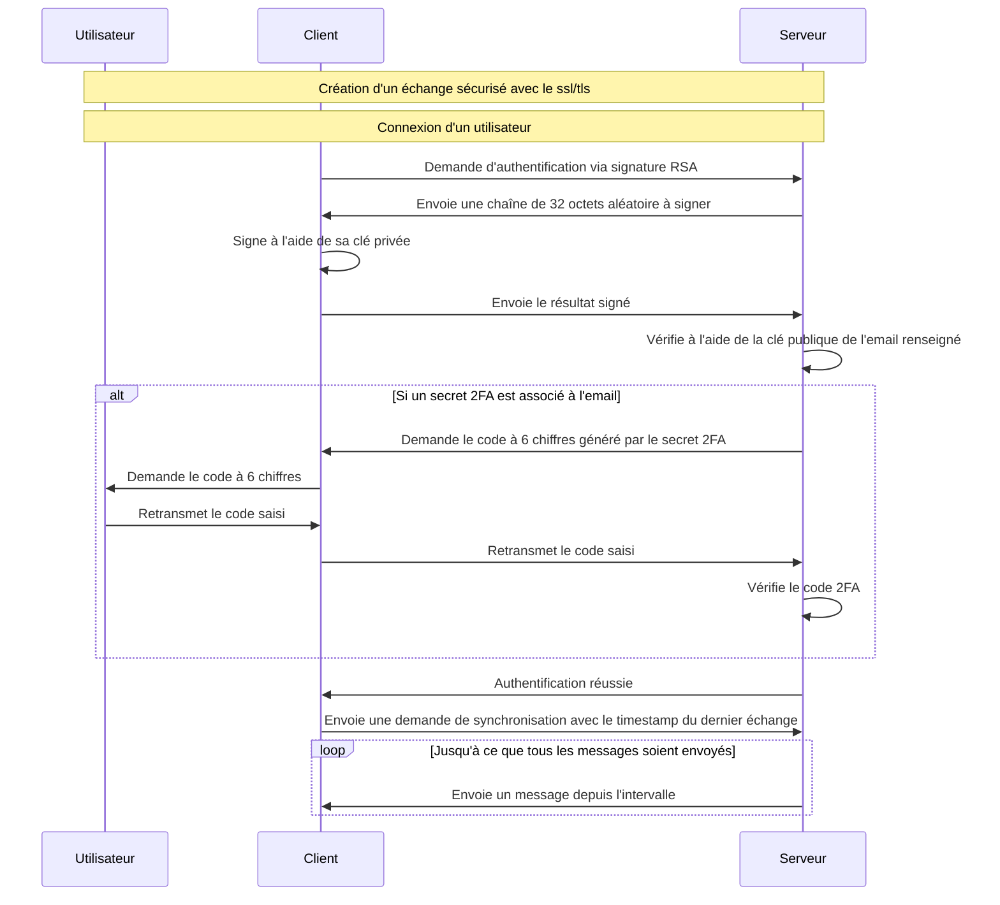

# Secure Chat Room

## Installation

L'installation est simple. Il suffit de télécharger le dépôt et de lancer un serveur ainsi qu'un ou plusieurs clients pour démarrer la communication ou l'échange de fichiers (notez que l'échange de fichiers n'est pas encore pris en charge).

Commande pour lancer le serveur, aucun fichier externe n'est nécessaire.

```bash
python .\InfinityLockServer.py --generate-default-cert
```

Et du côté client:

```bash
python .\InfinityLockClient.py --email [email (ici juste un pseudo)] --allow-invalid-cert
```

Pour obtenir des spécifications plus détaillées, vous pouvez exécuter la commande `-h` sur les deux exécutables pour découvrir rapidement les différentes configurations possibles.

## Prérequis

Dans le cadre de notre projet ou appel d'offres, le seul prérequis est d'avoir une machine capable d'exécuter Python version 3 et d'installer les extensions mentionnées dans les fichiers `requirements.txt`.

Pour installer les librairies, vous pouvez exécuter :

```bash
pip install -r serverRequirements.txt # Pour le serveur
pip install -r clientRequirements.txt # Pour le client
```

## Matériel(s) à brancher/configurer/installer (le cas échéant)

Aucune configuration matérielle nécessaire si ce n'est réseau pour s'assurer que les client aient accès au serveur.
Sinon, il est possible de modifier le comportement du client et du serveur avec les différentes options qu'il propose comme

- `--generate-default-cert` : Génère un certificat SSL par défaut si aucun n'est fourni. Utile pour les environnements de test.
- `--cert-path` : Spécifie le chemin d'accès au certificat SSL à utiliser pour une connexion sécurisée.
- `--key-path` : Indique le chemin d'accès à la clé privée correspondant au certificat SSL.
- `--disable-ssl` : Désactive l'utilisation du SSL pour la connexion, rendant la communication non sécurisée. À utiliser uniquement dans des environnements de test ou de développement.
- `--allow-invalid-cert` : Permet au client de se connecter même si le certificat du serveur n'est pas valide. Utile pour les tests avec des certificats auto-signés.
- `--debug` : Active le mode débogage pour fournir des logs plus détaillés, facilitant ainsi le diagnostic des problèmes.

## Scripts pour créer et/ou alimenter la base de données

Aucun script spécifique n'est requis pour créer ou alimenter la base de données, à moins que l'on considère Python comme un langage de script. Tout est créé et géré directement dans les différents exécutables pour rendre l'utilisation aussi simple et intuitive que possible.

## Identifiants pour se connecter (le cas échéant)

Pour le moment, il suffit d'entrer un pseudonyme pour "créer son compte". À terme, nous envisageons que l'enregistrement se fasse via un email (d'où le nom de l'argument). Une fois l'enregistrement effectué, un jeu de clés RSA est créé côté client. La clé publique est envoyée au serveur, permettant ainsi à tout le monde d'envoyer des messages au client sans que ceux-ci ne soient lisibles par le serveur.

Pour simplifier, je vous invite à consulter le diagramme de séquence :

- Si le fichier contenant le jeu de clés est absent sur le client, alors celui-ci est considéré comme non enregistré.



- Dans le cas contraire, celui-ci considère qu'il est enregistré



Après l'authentification réussie, le processus de synchronisation des messages commence. Le client envoie une demande au serveur pour récupérer tous les messages qu'il n'a pas encore reçus. Cette étape est cruciale pour garantir que l'utilisateur a accès à tous les messages manquants depuis sa dernière connexion. À l'avenir, il est envisagé d'améliorer ce système de synchronisation en intégrant le statut des messages, tels que "lu", "distribué" et "envoyé". Cela permettra une gestion plus fine des interactions et assurera que les utilisateurs aient une vue complète de l'état de leurs communications.

## Détails sur le chiffrement des messages

Chaque connexion est sécurisée par SSL/TLS, garantissant que le contenu des messages reste entièrement chiffré. Pour la communication individuelle, le chiffrement est assuré par des clés RSA. Concernant le partage de fichiers et les communications de groupe, le chiffrement AES est utilisé. Les clés AES sont sécurisées en étant chiffrées avec RSA avant d'être envoyées à chaque membre invité au groupe. Cette méthode est employée uniquement pour partager la clé AES du groupe, en encapsulant la clé dans un message chiffré avec RSA. L'objectif est d'assurer que rien ne soit accessible en clair sur le serveur, à l'exception des messages dans les salons de chat publics.

## Activation de services sur une plateforme Cloud

Aucun service spécifique n'est requis pour être activé. Il est essentiel de s'assurer que le serveur soit accessible depuis l'extérieur. Côté client, il est crucial de fournir les arguments appropriés lors du lancement pour établir la connexion avec le serveur, y compris l'adresse IP et le port.

## Tester rapidement le service

Pour tester rapidement le service, vous pouvez lancer le serveur avec :

```bash
python .\InfinityLockServer.py --generate-default-cert
```

Et pour lancer 1 ou plusieurs client

```bash
python .\InfinityLockClient.py --email [email] --allow-invalid-cert
```

Il suffit après de montrer les différents aspects à l'aide de l'interface.
