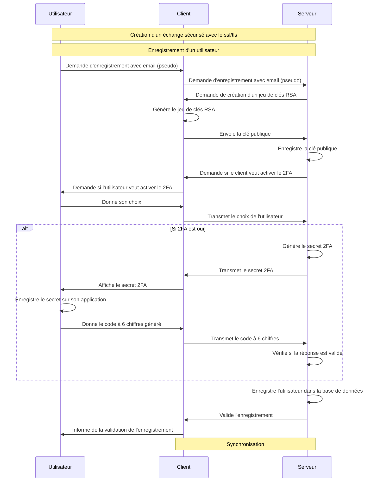
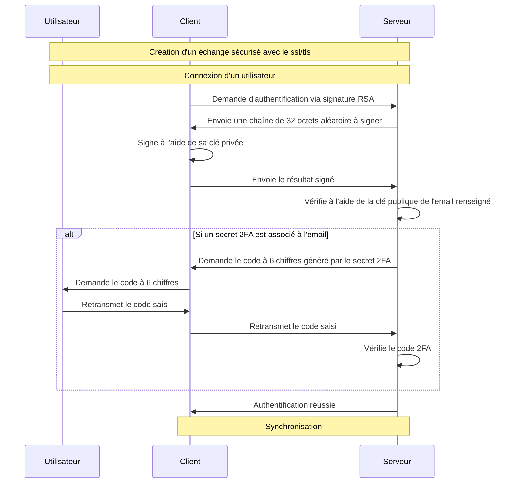
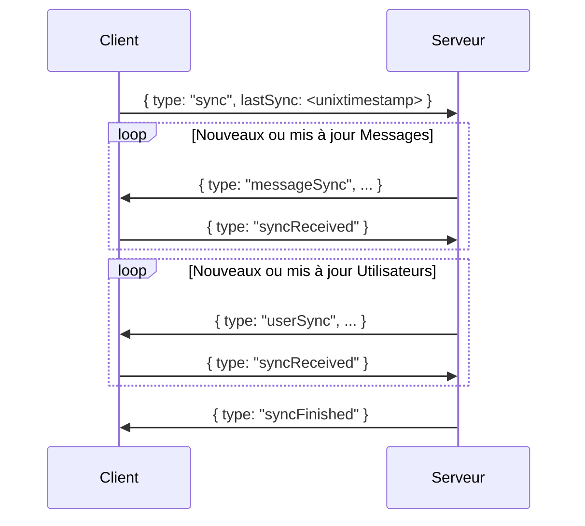

# Secure Chat Room

## Installation

L'installation est simple. Il suffit de télécharger le dépôt et de lancer un serveur ainsi qu'un ou plusieurs clients pour démarrer la communication ou l'échange de fichiers (notez que l'échange de fichiers n'est pas encore pris en charge).

Commande pour lancer le serveur, aucun fichier externe n'est nécessaire.

```bash
python .\InfinityLockServer.py --generate-default-cert --debug
```

Et du côté client:

```bash
python .\InfinityLockClient.py --allow-invalid-cert --debug
```

Pour obtenir des spécifications plus détaillées, vous pouvez exécuter la commande `-h` sur les deux exécutables pour découvrir rapidement les différentes configurations possibles.

## Prérequis

Dans le cadre de notre projet ou appel d'offres, le seul prérequis est d'avoir une machine capable d'exécuter Python version 3, d'installer les extensions mentionnées dans les fichiers `requirements.txt` et d'avoir installer tkinter (c'est une option dans l'installeur de python pour windows ou sur linux, il faut executé `apt-get install python-tk`).

Pour installer les librairies, vous pouvez exécuter :

```bash
pip install -r serverRequirements.txt # Pour le serveur
pip install -r clientRequirements.txt # Pour le client
```

## Argument et configuration

Aucune configuration particulière n'est nécessaire ; il faut juste s'assurer que les clients aient accès au serveur.
Le client et le serveur proposent différentes options pour modifier leur comportement.  
Arguments serveur :

- `address` : Spécifie l'adresse IP ou le nom d'hôte sur lequel le serveur doit écouter.
- `port` : Définit le port sur lequel le serveur acceptera les connexions entrantes.
- `--generate-default-cert` : Génère un certificat SSL par défaut si aucun n'est fourni. Utile pour les environnements de test.
- `--cert-path` : Spécifie le chemin d'accès au certificat SSL à utiliser pour une connexion sécurisée.
- `--key-path` : Indique le chemin d'accès à la clé privée correspondant au certificat SSL.

Arguments client :

- `serveur` : Adresse IP ou nom d'hôte du serveur auquel se connecter.
- `port` : Port du serveur auquel se connecter.
- `--allow-invalid-cert` : Permet au client de se connecter même si le certificat du serveur n'est pas valide. Utile pour les tests avec des certificats auto-signés.

Arguments en commun :

- `--disable-ssl` : Désactive l'utilisation du SSL pour la connexion, rendant la communication non sécurisée. À utiliser uniquement dans des environnements de test ou de développement.
- `--debug` : Active le mode débogage pour fournir des logs plus détaillés, facilitant ainsi le diagnostic des problèmes.

## Scripts pour créer et/ou alimenter la base de données

Aucun script spécifique n'est requis pour créer ou alimenter la base de données, à moins que l'on considère Python comme un langage de script. Tout est créé et géré directement dans les différents exécutables pour rendre l'utilisation aussi simple et intuitive que possible.

## Identifiants pour se connecter

Pour le moment, il suffit d'entrer un pseudonyme pour "créer son compte". À terme, nous envisageons que l'enregistrement se fasse via un email (d'où le nom de l'argument). Une fois l'enregistrement effectué, un jeu de clés RSA est créé côté client. La clé publique est envoyée au serveur, permettant ainsi à tout le monde d'envoyer des messages au client sans que ceux-ci ne soient lisibles par le serveur.

Pour simplifier, je vous invite à consulter le diagramme de séquence :

- Si le fichier contenant le jeu de clés est absent sur le client, alors celui-ci est considéré comme non enregistré.



- Dans le cas contraire, celui-ci considère qu'il est enregistré



Après l'authentification réussie, le processus de synchronisation des messages commence.

## Synchornisation et enregistement des messages

Une fois le client connecté, il demande une synchronisation pour recevoir/mettre à jour toutes les informations le concernant.



**Une fois que le client est connecté, le serveur transmet directement tous les messages qui lui sont destinés** ; il n'y a pas de demande de synchronisation toutes les millisecondes (et même principe pour l'interface tkinter, les sections sont mises à jour à la réception des données concernant une section (utilisateurs ou messages) à l'aide de varible commune).

Cette méthode **réduit la latence** et **optimise l'utilisation de la bande passante**, améliorant l'expérience utilisateur par des mises à jour en temps réel. Elle diminue également la charge sur le serveur, bénéfique dans les environnements à ressources limitées. L'usage d'une **variable commune** pour l'interface utilisateur garantit la **cohérence des données**, renforçant la fiabilité de l'application.

Les messages sont enregistrés dans une base de données locale avec une section en plus du serveur (messageId, fromUserEmail, toUserEmail, encrypted_message, `message`, updatedAt, createdAt). Cela s'explique par le fait que, une fois le message chiffré avec la clé publique du destinataire, il est impossible de le déchiffrer, d'où la nécessité de les sauvegarder en clair.

À terme, nous voulons également ajouter des statuts aux messages, tels que `lu`, `non lu` et `distibué`, ainsi que des statuts pour les utilisateurs, tels que `en ligne`, `hors ligne` et `occupé`.
C'est pour cela que la synchronisation se base sur `updatedAt`.

## Détails et le chiffrement des messages

**Chaque connexion est sécurisée par SSL/TLS**, garantissant que le contenu des messages reste entièrement chiffré. **Pour la communication individuelle, le chiffrement est assuré par des clés RSA**. Vous pouvez voir cela dans les logs ou dans le terminal si vous avez lancé le client ou le serveur en mode debug ; le contenu des messages n'est pas en clair, en plus que la communication soit englobée dans une session TLS.

Pour les **échanges de fichiers d'utilisateur à utilisateur, le chiffrement via des clés PGP sera utilisé**, étant donné que **les clés RSA ne peuvent pas chiffrer un message plus long que la clé elle-même**. Cela permet une sécurité renforcée pour le transfert de fichiers, assurant que seuls le destinataire puissent accéder au contenu du fichier.

**Concernant les communications et partage de fichiers de groupe, le chiffrement AES sera utilisé**. Les clés AES sont sécurisées en étant chiffrées avec RSA avant d'être envoyées à chaque membre invité au groupe. Cette méthode est employée uniquement pour partager la clé AES du groupe, en encapsulant la clé dans un message chiffré avec RSA. **L'objectif est d'assurer que rien ne soit accessible en clair sur le serveur**.

## Activation de services sur une plateforme Cloud

Aucun service spécifique n'est requis pour être activé. Il est essentiel de s'assurer que le serveur soit accessible depuis l'extérieur. Côté client, il est crucial de fournir les arguments appropriés lors du lancement pour établir la connexion avec le serveur, y compris l'adresse IP et le port.

## Tester rapidement le service

Pour tester rapidement le service, vous pouvez lancer le serveur avec :

```bash
python .\InfinityLockServer.py --generate-default-cert --debug
```

Copiez le dossier client pour pouvoir créer plusieurs clients distincts. Ceci génère des fichiers tels que la **clé**, la **base de données** pour enregistrer les utilisateurs et les messages, ainsi qu'un **fichier pour sauvegarder la dernière synchronisation**. Il est donc **nécessaire de copier le dossier client pour lancer plusieurs clients**.

Donc, pour lancer un client, il suffit de lancer la commande suivante :

```bash
python .\InfinityLockClient.py --allow-invalid-cert --debug
```

Attention : la fenêtre de connexion n'apparaît pas au premier plan au début.

Puis, il suffit de suivre les instructions pour vous enregistrer initialement, puis connectez-vous avec le même pseudonyme si vous relancez l'exécutable.  
Note : Le programme ne se termine pas à la fermeture de la fenêtre. Il est nécessaire d'envoyer un ou plusieurs signaux avec `CTRL+C` pour le fermer correctement.

Et normalement, vous êtes en mesure de pouvoir envoyer des messages d'un client à un autre en toutes circonstances.

## A faire

- Ajouter ou migrer vers le PGP
- Implémenté l'envoie de fichier
- Ajouter la création et la gestion de groupe
