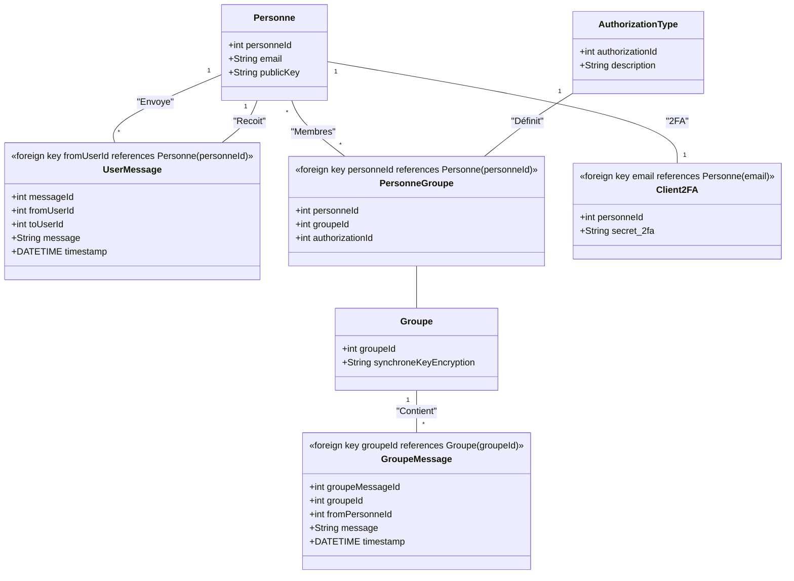

# Server Database structure

```mermaid
classDiagram
    class Personne {
        +int personneId
        +String email
        +String publicKey
    }
    class UserMessage {
        +int messageId
        +int fromUserId
        +int toUserId
        +String message
        +DATETIME timestamp
        <<foreign key fromUserId references Personne(personneId)>>
        <<foreign key toUserId references Personne(personneId)>>
    }
    class Groupe {
        +int groupeId
        +String synchroneKeyEncryption
    }
    class GroupeMessage {
        +int groupeMessageId
        +int groupeId
        +int fromPersonneId
        +String message
        +DATETIME timestamp
        <<foreign key groupeId references Groupe(groupeId)>>
    }
    class AuthorizationType {
        +int authorizationId
        +String description
    }
    class PersonneGroupe {
        +int personneId
        +int groupeId
        +int authorizationId
        <<foreign key personneId references Personne(personneId)>>
        <<foreign key groupeId references Groupe(groupeId)>>
        <<foreign key authorizationId references AuthorizationType(authorizationId)>>
    }
    class Client2FA {
        +int personneId
        +String secret_2fa
        <<foreign key email references Personne(email)>>
    }
    Personne "1" -- "*" UserMessage : "Envoye"
    Personne "1" -- "*" UserMessage : "Recoit"
    Groupe "1" -- "*" GroupeMessage : "Contient"
    Personne "*" -- "*" PersonneGroupe : "Membres"
    PersonneGroupe -- Groupe
    AuthorizationType "1" -- "*" PersonneGroupe : "Définit"
    Personne "1" -- "1" Client2FA : "2FA"
```
